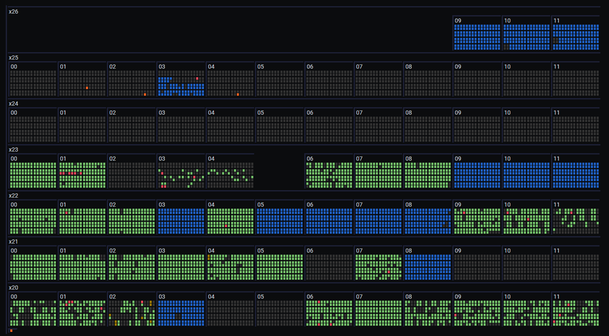
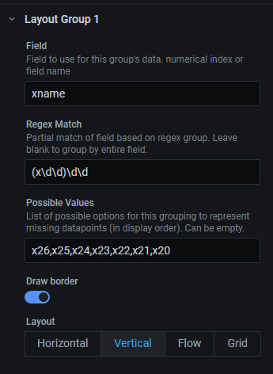
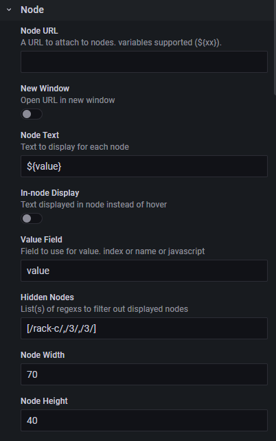

# Clusterview Grafana Plugin

A plugin for grafana that provides a dense view of data points.

## Expected Query Data Format
Data is expected in the long format with a value column and one or more columns describing the layout. Additional field(s) can be present to provide additional information for mouseover, in-block display, or URLs for clickable links.

A minimal example of query data:

|      location |value|
| ------------- |-----|
| x1000c0s0b0n0 | 20.1|
| x1000c1s2b1n0 | 21.2|
| x1001c0s7b0n0 | 20.7|
|...|

A more complex query might add fields for additional text displays or urls, and/or split the location to multiple fields:

| name      |  row  | slot | index |value| extid  |
| -         | -     | -    | -     | -   | -      |
| node 11-0 | 1     | 1    | 0     | 20.1| bk39dj |
| node 12-0 | 1     | 2    | 0     | 21.2| sMfek3 |
| node 21-0 | 2     | 1    | 0     | 20.7| BL9bap |
| node 21-1 | 2     | 1    | 1     | 16.0| LQ0doV |
|...|

### Data Grouping
The display is organized into a hierarchy based on one or more fields. Each layer of the hierachy can be configured differently to result in more complex layouts.

#### Field
Defines which field contains the location data for this layer. This can be either the name of the Field or can be a zero-indexed integer. If left blank, this will be the final layout group in the hierarchy.

#### Regex Match
A regular expression to extract location data from a field. This should be a regex with a singular capture group that defines the values for this layer in the hierarchy. If a Field does not need to be divided into pieces this can be left blank and the entire value will be used.

For example, if the location field looks like `x1000c0s0b0n0` then the regex match fields might be written as:

1. `(x\d+)` - identifier: x1000
1. `x\d+(c\d)` - identifier: c0
1. `x\d+c\d(s\d)` - identifier: s0

#### Possible Values
a set of possible instances that can exist for this layer can be specified here. A null-value placeholder will be shown for any values listed that are not present in the query. This can create a consistent output when query data is missing. It is also used to specificy an order to the values, which are otherwise displayed in the order of data in the query.

#### Draw border and Show Label
Show labels or (partial) borders around data. 

Note: The borders and labels display around all entities in a layer and not individual instances in the layer, so their application may not always be intuitive.

#### Layout
Each layer (group) of the hierarchy can be laid out in a different layout orientation. 
Multiple layers with different layouts can combine to result in a complex arrangement.
The layout types are:
 * horizontal - nodes display across the screen
 * vertical - nodes display vertically.
 * flow - like horizontal, but will wrap to the next line
 * grid - like flow, but the wrapping 

### Node

The node section describes details about displaying nodes.

#### Node URL

If Node URL is present, each node is made into a link to the given url. Variables can included in the url as well `${FieldName}`.

#### Node Text

The text to display on mouseover, or if In-Node Display is selected, directly on the node.

#### Value Field

Use this to specify the value used to determine colors for the display. This can be an integer index for the Field or the Field name.

* `1`
* `value`

For advanced uses, the value field can contain javascript to augment/replace the value considered for coloring. This javascript will execute for each row of data. An array named `fields` is made available that provides the data for each column as either index, name, or display name. This should always return a numerical value.

* `return fields[1]*2`
* `var a=fields['value'];if (a>15) return 1 else return 0`

#### Hidden Nodes

In some cases there may be nodes you wish to set aside space for but do not wish to display as missing. This might be to match a physical layout where something isn't present or populated. The hidden nodes field allows this. It takes one or more arrays of regexes to match against the different values in each layer group.

For each match desired, an array should be provided. That array should have the same number of elements as there are layers in the hierarchy. Each element should be a regex (escaped with /) that matches data on that layer. An array of regexes can be provided if only one match is needed. If there are multiple, an array of arrays should be used.

Given a dashboard having a 3 layer group hierarchy with the first layer of a,b,c; the second layer of 1,2,3; and the third layer also 1,2,3; the following would be examples of hidden node values:
* `[ /a/, /1/, /2/]` - node a12 will be left blank.
* `[ [ /b/, /.*/, /.*/],  [ /c/, /1/, /.*/]]` - All of b* and anything starting with c1* will be left blank.

### Values/Colors

A configuration for the spectrum of colors to display. Colors will be interpolated based on the query value. Values outside the range of given thresholds will be clamped to the nearest endpoint.

#### Threshold Color/Value

A singular color point at a particular value. Multiple thresholds can be specified to provide a full spectrum of colors.

Exact colors for ranges are not yet supported. If only explicit values are desired, the data must either be augmented to hit values exactly or multiple thresholds of the same colors can be provided such that interpolation results in the same color.

### Aggregate

In the case of timeseries data, do an aggregate to reduce each node to a singular value. It's not recommended to do this in the query and/or transform if possible.

#### Timestamp Field
The field to use as a timestamp. Relatively 
#### Aggregate data

#### Ignore Null Values

If set, null values will be filtered out of the dataset. 

